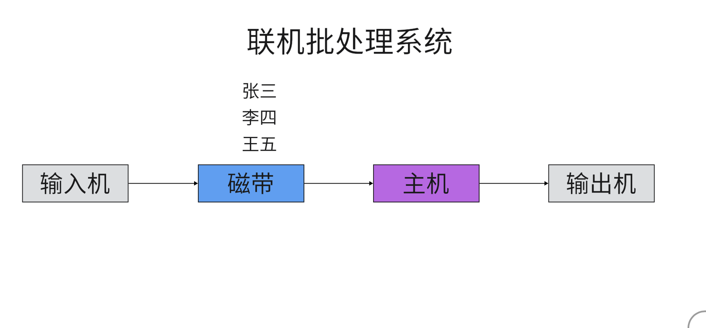
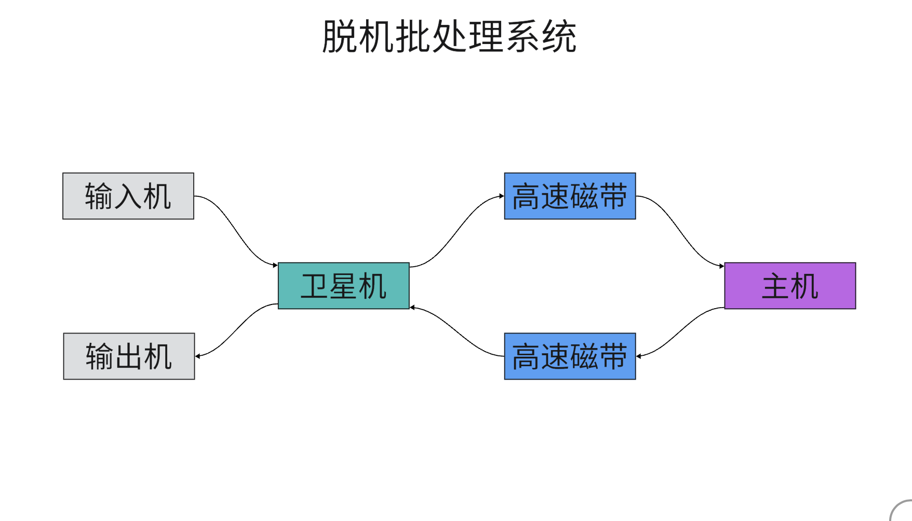
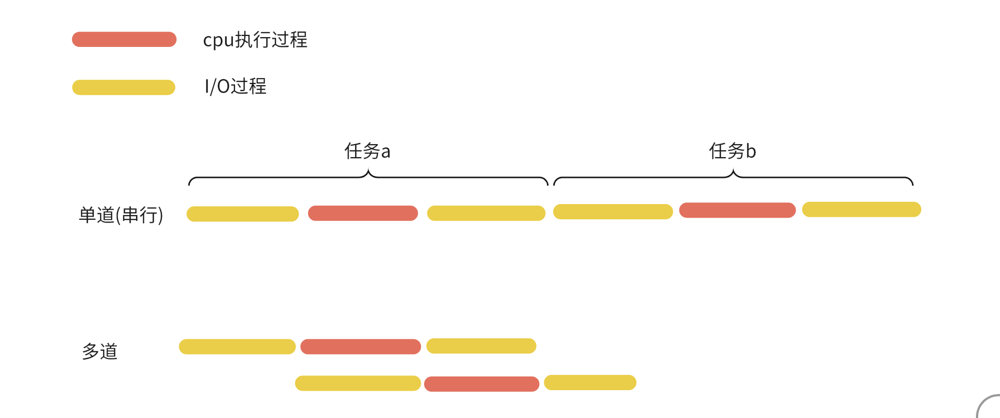
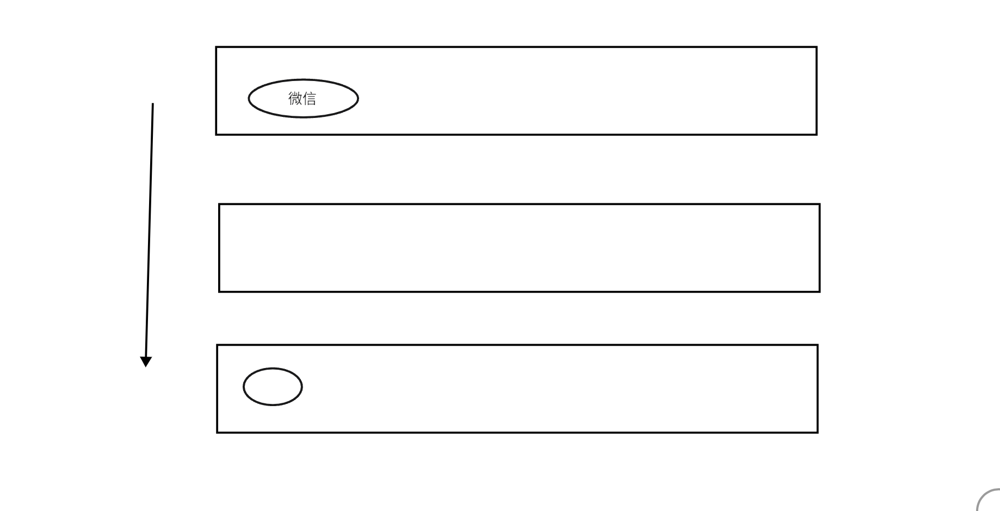
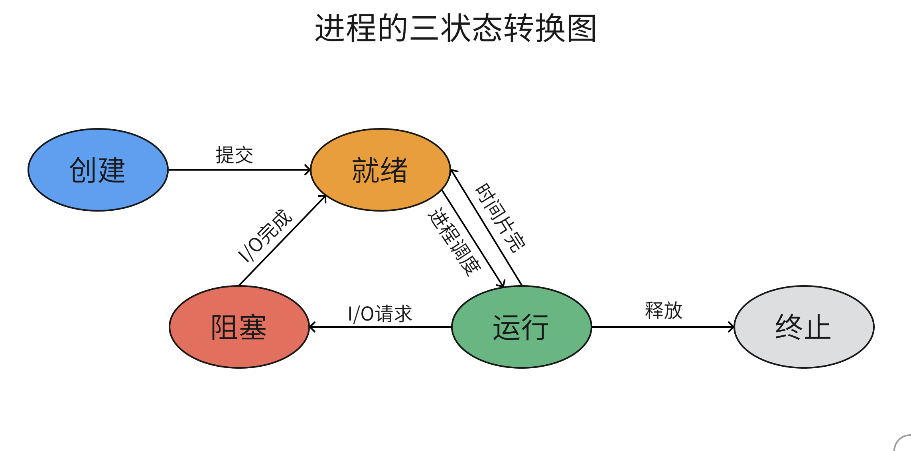
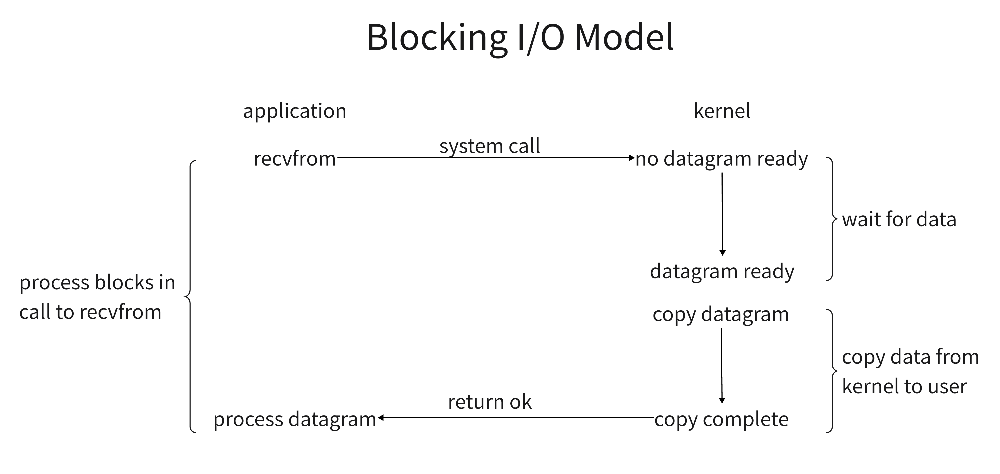
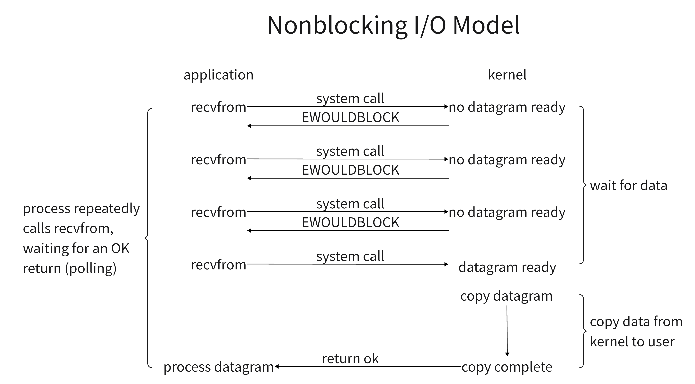
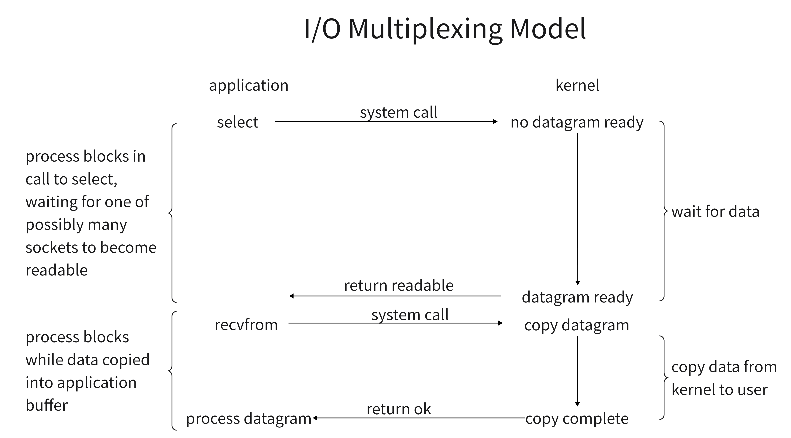
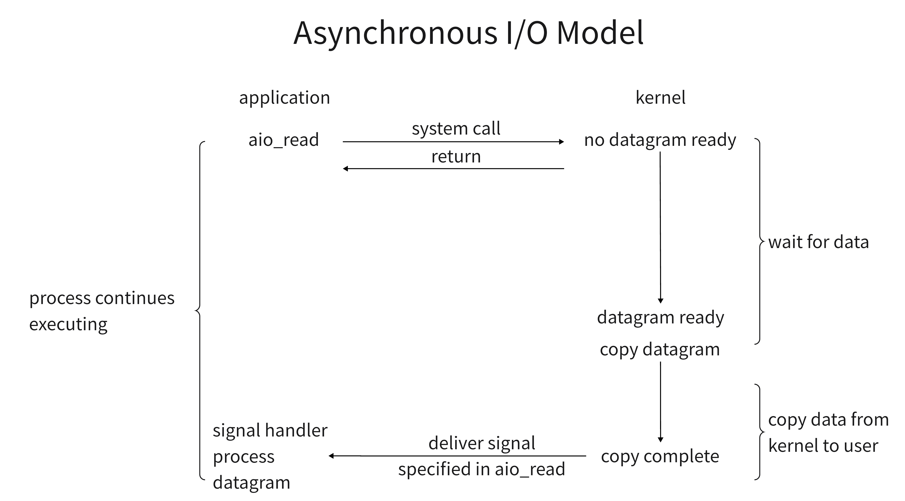

# 并发编程


```python
coding: utf-8
@Author: 小飞有点东西
资料下载：https://active.clewm.net/FrcyFA
```


## 后续建议

```tex
服务器

并发编程

懂得取舍，是什么，做什么，怎么用

知识面的广度，自我解决问题的能力

基本概念，理解，哪怕这个概念不是很正确
```


## 操作系统发展史

```tex
1946年

18000个电子管，170平米

程序员

码农

码畜
```


## 穿孔卡片


## 联机批处理系统




## 脱机批处理系统




## 多道技术

- 目的：让单核实现并发效果

- 并发：看起来像同时运行的

- 并行：真正意义上的同时执行

- 单核不能实现并行，但可以实现并发

- 多道：允许多个应用程序同时进入内存，并且cpu交替执行

  

- 核心：切换+保存状态

- cpu切换的时候，分两种情况
  - 当一个程序遇到I/O操作的时候，操作系统会剥夺该程序cpu的执行权限
  - 当一个程序长时间占用cpu的时候，操作系统也会剥夺该程序cpu的执行权限


## 进程

- 程序：存在硬盘上的一堆代码，它是'死'的

- 进程：表示程序正在执行的过程，它是'活'的

Ps:内存里有一个微信程序正在运行

Ps:微信进程，pycharm进程


## 进程调度

- 先来先服务调度算法

  - ```tex
    3秒，3小时，3秒，3秒，对长作业友好，对短作业不友好
    ```

- 短作业优先调度算法

  - ```tex
    3秒，。。。。。。。3秒，3小时，对短作业友好，对长作业不友好
    ```

- 时间片轮转法+多级反馈队列

  - 越往下,任务的优先级越低
  - 越往下,任务的耗时越长
  
  


## 进程的三状态图




## 同步和异步

用来描述任务的提交方式

- 同步: 任务提交之后,原地等待任务的返回结果,等待的过程中不做任何事情
- 异步: 任务提交之后,不在原地等待任务的返回结果,而是直接去做其他事情


## 阻塞和非阻塞

描述进程的运行状态

- 阻塞: 阻塞态
- 非阻塞: 就绪态、运行态


同步阻塞、同步非阻塞、异步阻塞、**异步非阻塞**


## 创建进程

```python
'''
os.fork()
multiprocessing
subprocess
'''

# 方式1
from multiprocessing import Process
import time


def func(name):
    print(f'{name}任务开始')
    time.sleep(5)
    print(f'{name}任务执行完毕')


if __name__ == '__main__':
    # 1、得到进程操作对象
    p = Process(target=func, args=('写讲话稿',))
    # 2、创建进程
    p.start()
    print('主进程')


# 方式2
from multiprocessing import Process
import time


class MyProcess(Process):
    def __init__(self, name):
        super().__init__()
        self.task_name = name

    def run(self):
        print(f'{self.task_name}任务开始')
        time.sleep(5)
        print('任务结束')


if __name__ == '__main__':
    p = MyProcess('约会')
    p.start()
    print('主进程')


```

**总结**: 创建进程就是在内存中申请一块内存空间,然后把需要运行的代码放进去,多个进程的内存空间,它们彼此是隔离的,进程与进程之间的数据,它们是没办法直接交互的,如果想要交互,则可以借助第三方工具/模块


## join方法

```python
# coding: utf-8
# @Author: 小飞有点东西
# 资料下载：https://active.clewm.net/FrcyFA

# # 方式1
from multiprocessing import Process
import time


def func(name, n):
    print(f'{name}任务开始')
    time.sleep(n)
    print(f'{name}任务执行完毕')


if __name__ == '__main__':
    start = time.time()
    # p1 = Process(target=func, args=('写讲话稿1', 1))
    # p2 = Process(target=func, args=('写讲话稿2', 2))
    # p3 = Process(target=func, args=('写讲话稿3', 3))
    # p1.start()
    # p2.start()
    # p3.start()
    # p1.join()
    # p2.join()
    # p3.join()
    l = []
    for i in range(1, 4):
        p = Process(target=func, args=(f'写讲话稿{i}', i))
        p.start()
        l.append(p)
    for p in l:
        p.join()
    print('主进程')
    end = time.time()
    print(end - start)

```

## 进程之间数据隔离

```python
# coding: utf-8
# @Author: 小飞有点东西
# 资料下载：https://active.clewm.net/FrcyFA


from multiprocessing import Process


age = 18


def func():
    global age
    age = 16


if __name__ == '__main__':
    p = Process(target=func)
    p.start()
    p.join()
    print(age)

```


## 进程号

```python
# pid号（进程号）

from multiprocessing import Process, current_process
import time
import os


def task(name='子进程'):
    # print(f'任务{current_process().pid}执行中')
    print(f'{name}{os.getpid()}执行中')
    print(f'{name}的父进程{os.getppid()}执行中')
    # time.sleep(100)


if __name__ == '__main__':
    p = Process(target=task)
    p.start()
    p.terminate()   # 杀死当前进程（win: taskkill pid,  mac/linux: kill -9 pid)
    time.sleep(0.001)
    print(p.is_alive())
    print('主进程')
    # task('主进程')
```


## 僵尸进程和孤儿进程

了解

- 僵尸进程

  ```python
  '''
  子进程死后,还会有一些资源占用(进程号,进程运行状态,运行时间等),等待父进程通过系统调用回收(收尸)
  除了init进程之外,所有的进程,最后都会步入僵尸进程
  危害:
  	子进程退出之后,父进程没有及时处理,僵尸进程就会一直占用计算机资源
  	如果产生了大量的僵尸进程,资源过度占用,系统没有可用的进程号,导致系统不能产生新的进程
  '''
  ```

- 孤儿进程

  ```python
  '''
  子进程处于存活状态,但是父进程意外死亡
  操作系统会开设一个“孤儿院”(init进程),用来管理孤儿进程,回收孤儿进程的相关资源
  '''
  ```


## 守护进程

```python
# coding: utf-8
# @Author: 小飞有点东西
# 资料下载：https://active.clewm.net/FrcyFA


from multiprocessing import Process
import time


def task(name):
    print(f'{name}还活着')
    time.sleep(5)
    print(f'{name}正常死亡')


if __name__ == '__main__':
    p = Process(target=task, kwargs={'name': '苏妲己'})
    p.daemon = True
    p.start()
    time.sleep(1)
    print('纣王驾崩了')

```


## 互斥锁

当多个进程操作同一份数据的时候,会出现数据错乱的问题,解决方法就是加锁处理:

**把并发变成串行,虽然牺牲了运行效率,但是保证了数据的安全**

```python
# coding: utf-8
# @Author: 小飞有点东西
# 资料下载：https://active.clewm.net/FrcyFA


from multiprocessing import Process, Lock
import time
import json
import random


# 查票
def search_ticket(name):
    # 读取文件，查询车票数量
    with open('data/tickets', 'r', encoding='utf-8')as f:
        dic = json.load(f)
    print(f'用户{name}查询余票：{dic.get("tickets_num")}')


# 买票
def buy_ticket(name):
    with open('data/tickets', 'r', encoding='utf-8')as f:
        dic = json.load(f)
    # 模拟网络延迟
    time.sleep(random.randint(1, 5))
    if dic.get('tickets_num') > 0:
        dic['tickets_num'] -= 1
        with open('data/tickets', 'w', encoding='utf-8')as f:
            json.dump(dic, f)
        print(f'用户{name}买票成功')
    else:
        print(f'余票不足，用户{name}买票失败')


def task(name, mutex):
    search_ticket(name)
    mutex.acquire()  # 抢锁
    buy_ticket(name)
    mutex.release()  # 释放锁


if __name__ == '__main__':
    mutex = Lock()
    for i in range(1, 9):
        p = Process(target=task, args=(i, mutex))
        p.start()

```

ps: 行锁、表锁

<u>注意:不要轻易加锁,加锁只应该在争抢数据的环节加</u>


## 消息队列

**队列:先进先出**

​	管道+锁

堆栈:后进先出

```python
# coding: utf-8
# @Author: 小飞有点东西
# 资料下载：https://active.clewm.net/FrcyFA


# import queue
# queue.Queue()

# from multiprocessing import queues
# queues.Queue()

from multiprocessing import Queue


q = Queue(6)
q.put('a')
q.put('b')
q.put('c')
q.put('d')
# print(q.full())
# print(q.empty())
q.put('e')
q.put('f')
# q.put('g', timeout=3)
# q.put_nowait('g')
# print(q.full())

v1 = q.get()
v2 = q.get()
v3 = q.get()
v4 = q.get()
v5 = q.get()
v6 = q.get()
# v7 = q.get(timeout=3)
# q.get_nowait()
print(v1, v2, v3, v4, v5, v6)

print(q.empty())

"""
q.put()
q.get()

再多进程的条件下不够准确
q.put_nowait()
q.get_nowait()
q.full()
q.empty()
"""
```


## 进程间的通信(IPC机制)

```python
# coding: utf-8
# @Author: 小飞有点东西
# 资料下载：https://active.clewm.net/FrcyFA


from multiprocessing import Process, Queue


def task1(q):
    q.put('宫爆鸡丁')


def task2(q):
    print(q.get())


if __name__ == '__main__':
    q = Queue()
    p1 = Process(target=task1, args=(q,))
    p2 = Process(target=task2, args=(q,))
    p1.start()
    p2.start()

    # print(q.get())
```


## 生产者消费者模型

生产者（厨师）：生产或者制造数据的

消费者（顾客）：消费或者处理数据的

媒介（桌子）：消息队列

```python
# coding: utf-8
# @Author: 小飞有点东西
# 资料下载：https://active.clewm.net/FrcyFA


from multiprocessing import Process, Queue, JoinableQueue
import time
import random

'''
JoinableQueue
在Queue的基础上多了一个计数器机制，每put一个数据，计数器就加一
每调用一次task_done，计数器就减一
当计数器为0的时候，就会走q.join后面的代码
'''


def producer(name, food, q):
    for i in range(8):
        time.sleep(random.randint(1, 3))
        print(f'{name}生产了{food}{i}')
        q.put(f'{food}{i}')


def consumer(name, q):
    while True:
        food = q.get()
        time.sleep(random.randint(1, 3))
        print(f'{name}吃了{food}')
        # if food == '鹤顶红':
        #     break
        q.task_done()   # 告诉队列，已经拿走了一个数据，并且已经处理完了


if __name__ == '__main__':
    q = JoinableQueue()
    p1 = Process(target=producer, args=('中华小当家', '黄金炒饭', q))
    p2 = Process(target=producer, args=('神厨小福贵', '佛跳墙', q))
    c1 = Process(target=consumer, args=('八戒', q))
    c2 = Process(target=consumer, args=('悟空', q))
    p1.start()
    p2.start()

    c1.daemon = True
    c2.daemon = True

    c1.start()
    c2.start()

    p1.join()
    p2.join()
    # q.put('鹤顶红')
    # q.put('鹤顶红')

    q.join()    # 等待队列中所有的数据被取完，计数器变成0
    # 主进程死了，消费者也要跟着陪葬，守护进程
```


## 线程

进程：资源单位

线程：执行单位


创建进程

- 申请内存空间	消耗资源
- 拷贝代码     消耗资源

创建线程：在一个进程内可以创建多个线程，同一个进程内，多个线程之间的资源是共享的

- 不需要再次申请内存空间
- 不需要拷贝代码


开发一个自动保存的编辑器

- 获取键盘输入
- 把输入的内容实时显示到屏幕
- 自动保存到硬盘


## 创建线程

```python
# 方式一
from threading import Thread
import time


def task(name):
    print(f'{name} 任务开始')
    time.sleep(3)
    print(f'{name} 任务结束')


if __name__ == '__main__':
    t = Thread(target=task, args=('悟空',))
    t.start()
    print('主线程')
    

# 方式二
from threading import Thread
import time


class MyThread(Thread):
    def __init__(self, name):
        super().__init__()
        self.name = name

    def run(self):
        print(f'{self.name} 任务开始')
        time.sleep(3)
        print(f'{self.name} 任务结束')


if __name__ == '__main__':
    t = MyThread('悟空')
    t.start()
    print('主线程')
```


## TCP并发效果

```python
# 服务端
import socket
from multiprocessing import Process
from threading import Thread


s = socket.socket()
s.bind(('127.0.0.1', 8002))
s.listen(5)


def task(conn):
    # 通信循环
    while True:
        try:
            data = conn.recv(1024)
        except:
            break
        if not data:
            break
        print(data.decode('utf-8'))
        conn.send(data.upper())
    conn.close()


if __name__ == '__main__':

    while True:
        conn, addr = s.accept()
        # p = Process(target=task, args=(conn,))
        p = Thread(target=task, args=(conn,))
        p.start()

# 客户端
import socket
import time


c = socket.socket()
c.connect(('127.0.0.1', 8002))
while True:
    c.send(b'hello')
    data = c.recv(1024)
    print(data.decode('utf-8'))
    time.sleep(2)
```


## join方法

```python
from threading import Thread
import time


def task(name):
    print(f'{name} 任务开始')
    time.sleep(3)
    print(f'{name} 任务结束')


if __name__ == '__main__':
    t = Thread(target=task, args=('悟空',))
    t.start()
    t.join()
    print('主线程')
```


## 进程间数据共享

```python
from threading import Thread
import os


age = 18


def task():
    # print('子线程', os.getpid())
    global age
    age = 16


if __name__ == '__main__':
    t = Thread(target=task)
    t.start()
    # print('主线程', os.getpid())
    print(age)
    
    print('当前线程的名字', current_thread().name)
    print('进程中活跃的线程数量', active_count())
```


## 守护线程

```python
'''
主线程运行完毕之后，它不会立刻结束，要等待所有子线程运行完毕之后才会结束；
因为主线程结束，就意味着主线程所在的进程结束了
'''

from threading import Thread
import time


def task(name):
    print(f'{name} 还活着')
    time.sleep(3)
    print(f'{name} 正常死亡')


if __name__ == '__main__':
    t = Thread(target=task, args=('妲己',))
    t.daemon = True
    t.start()
    print('纣王驾崩了')
    

    
```

例子

```python
# 例子：
from threading import Thread
import time


def f1():
    print('任务1开始')
    time.sleep(3)
    print('任务1结束')


def f2():
    print('任务2开始')
    time.sleep(2)
    print('任务2结束')


if __name__ == '__main__':
    t1 = Thread(target=f1)
    t2 = Thread(target=f2)
    t1.daemon = True
    t1.start()
    t2.start()
    print('主线程')
```


## GIL全局解释器锁

https://wiki.python.org/moin/GlobalInterpreterLock

In CPython, the **global interpreter lock**, or **GIL**, is a mutex that protects access to Python objects, preventing multiple threads from executing Python bytecodes at once. The GIL prevents race conditions and ensures thread safety. A nice explanation of [how the Python GIL helps in these areas can be found here](https://python.land/python-concurrency/the-python-gil). In short, this mutex is necessary mainly because CPython's memory management is not thread-safe.

在Cpython解释器中，GIL是一把互斥锁，用来阻止同一个进程下的多个线程同时执行，也就是说在同一个进程下的多个线程，它们没办法并行，有多个cpu都不能并行，一次只有一个cpu来执行


~~问题：python的多线程好像没什么卵用？无法利用多核优势，即便有多个核，一次也只能用一个~~

分情况

- 单核
  - 10个任务（计算密集型/IO密集型）
- 多核
  - 10个任务（计算密集型/IO密集型）

多核(cpu10个核)

- 计算密集型	每一个任务都需要10s，
  - 多线程  100+
  - 多进程  10+  **效率高**
- IO密集型
  - 多线程  **节省资源**
  - 多进程  浪费资源

CPython的内存管理不是线程安全的

内存管理(垃圾回收机制)

- 引用计数
- 标记清除
- 分代回收

GC巡逻


python解释器版本

- **Cpython**
- Jpython
- Pypypython

注意：

- GIL不是python的特点，而是Cpython解释器独有的特点
- GIL会导致同一个进程下的多个线程不能同时执行，无法利用多核能力
- GIL保证的是解释器级别的数据的安全
- 我们写代码的时候，该怎么写就怎么写，不用考虑GIL


总结：

- 多进程和多线程都有各自的优势，以后写项目的时候，通常可以多进程下开设多线程
- 我们现在开发的程序，90%以上，其实都是IO密集型的，多线程优势更大
- 多进程使用场景（挖矿、造氢弹原子弹、训练人工智能、解决三体问题），利用cpu的多核能力


## 死锁

```python
from threading import Thread, Lock, current_thread
import time


mutex1 = Lock()
mutex2 = Lock()


def task():

    mutex1.acquire()
    print(current_thread().name, '抢到锁1')
    mutex2.acquire()
    print(current_thread().name, '抢到锁2')
    mutex2.release()
    mutex1.release()
    task2()


def task2():
    mutex2.acquire()
    print(current_thread().name, '抢到锁2')
    time.sleep(1)
    mutex1.acquire()
    print(current_thread().name, '抢到锁1')
    mutex1.release()
    mutex2.release()


if __name__ == '__main__':
    for i in range(8):
        t = Thread(target=task)
        t.start()
```


## 递归锁

内部有一个计数器，每acquire一次计数器就会+1，每release一次计数器就会-1，只要计数器不为0，其他人就不能抢到这把锁

```python
from threading import Thread, Lock, current_thread, RLock
import time


# mutex1 = RLock()
# mutex2 = mutex1
mutex2 = mutex1 = RLock()


def task():

    mutex1.acquire()
    print(current_thread().name, '抢到锁1')
    mutex2.acquire()
    print(current_thread().name, '抢到锁2')
    mutex2.release()
    mutex1.release()
    task2()


def task2():
    mutex2.acquire()
    print(current_thread().name, '抢到锁2')
    time.sleep(1)
    mutex1.acquire()
    print(current_thread().name, '抢到锁1')
    mutex1.release()
    mutex2.release()


if __name__ == '__main__':
    for i in range(8):
        t = Thread(target=task)
        t.start()
```


## 信号量

信号量在不同的阶段，可能会对应不同的技术点，对于并发编程来说，它指的是”锁“

他可以用来控制同时访问特定资源的线程数量，通常用于某些资源有明确访问数量限制的场景，简单说就是用于**限流**

例子：停车场

```python
"""
互斥锁：停车场只有一个车位
信号量：停车场可以有多个车位
"""
# coding: utf-8
# @Author: 小飞有点东西
# 资料下载：https://active.clewm.net/FrcyFA


from threading import Thread, Semaphore
import time
import random


sp = Semaphore(5)


def task(name):
    sp.acquire()
    print(name, '抢到车位')
    time.sleep(random.randint(3, 5))
    sp.release()


if __name__ == '__main__':
    for i in range(25):
        t = Thread(target=task, args=(f'宝马{i+1}号',))
        t.start()

```


## Event事件

```python
# coding: utf-8
# @Author: 小飞有点东西
# 资料下载：https://active.clewm.net/FrcyFA


from threading import Thread, Event
import time


event = Event()


def bus():
    print('公交车即将到站')
    time.sleep(3)
    print('公交车到站了')
    # 告诉等车的人可以上车了
    event.set()  # 发射信号，车来了赶紧上车


def passenger(name):
    print(name, '正在等车')
    event.wait()
    print(name, '上车出发')


if __name__ == '__main__':
    t = Thread(target=bus)
    t.start()

    for i in range(10):
        t = Thread(target=passenger, args=(f'乘客{i}',))
        t.start()
```


## 池

池是用来保证计算机硬件安全的情况下，最大限度的利用计算机资源，降低了程序运行效率，但是保证了计算机硬件的安全

```python
# 信号量：锁，线程自己创建，控制线程执行，阻塞
# 线程池：线程由线程池创建，控制线程数量

from concurrent.futures import ThreadPoolExecutor, ProcessPoolExecutor
import time
import os

# pool = ThreadPoolExecutor(10)  # 不传参的话，默认开设的线程数量，是当前cpu的个数乘以5
pool = ProcessPoolExecutor(3)  # 不传参的话，默认开设的进程数量，是当前cpu的个数


def task(name):
    print(name, os.getpid())
    time.sleep(3)
    return name + 10

future = pool.submit(task, i)
```


## 异步回调机制

```python
from concurrent.futures import ThreadPoolExecutor, ProcessPoolExecutor
import time
import os

# pool = ThreadPoolExecutor(10)  # 不传参的话，默认开设的线程数量，是当前cpu的个数乘以5
pool = ProcessPoolExecutor(3)  # 不传参的话，默认开设的进程数量，是当前cpu的个数


def task(name):
    print(name, os.getpid())
    time.sleep(3)
    return name + 10

  
def call_back(res):
    print('call_back', res.result())

pool.submit(task, i).add_done_callback(call_back)
```


## 协程

也可以称为微线程，它是一种用户态内的上下文切换技术，简单说就是在单线程下实现并发的效果

```python
"""
进程：资源单位
线程：执行单位
协程：程序员人为创造出来的，不存在（切换+保存状态）

当程序遇到IO的时候，通过我们写的代码，让我们的代码自动完成切换
也就是我们通过代码来监听IO，一旦程序遇到IO，就在代码层面上自动切换，给cpu的感觉就是我们的程序没有IO，换句话说就是，我们欺骗了cpu
"""
```

注意：切换不一定是提升效率，还有可能降低效率

​		遇到IO切，就会提升效率；

​		对于计算密集型任务来说，切换反而会降低效率；

- yield
- gevent

```python
pip3 install gevent
```

```python
from gevent import monkey
monkey.patch_all()
from gevent import spawn
import time


def da():
    for _ in range(3):
        print('哒')
        time.sleep(2)


def mie():
    for _ in range(3):
        print('咩')
        time.sleep(2)


def buyao():
    for _ in range(3):
        print('不要')
        time.sleep(3)


start = time.time()
g1 = spawn(da)
g2 = spawn(mie)
g3 = spawn(buyao)
g1.join()
g2.join()
g3.join()
end = time.time()
# print(end - start)  # 12.029063940048218
print(end - start)  # 6.019258975982666
print(end - start)  # 9.015071868896484
```

协程实现tcp并发：

```python
# coding: utf-8
# @Author: 小飞有点东西
# 资料下载：https://active.clewm.net/FrcyFA

# server
from gevent import monkey;monkey.patch_all()
import socket
from gevent import spawn


def comm(conn):
    while True:
        try:
            data = conn.recv(1024)
            if not data:
                break
            conn.send(data.upper())
        except:
            break
    conn.close()


def run(ip, port):
    server = socket.socket()
    server.bind((ip, port))
    server.listen(5)
    while True:
        conn, addr = server.accept()
        spawn(comm, conn)


if __name__ == '__main__':
    g = spawn(run, '127.0.0.1', 8001)
    g.join()

    
# client
import socket
from threading import Thread, current_thread


def t_client():
    client = socket.socket()
    client.connect(('127.0.0.1', 8001))

    num = 0
    while True:
        msg = f'{current_thread().name} say {num}'
        client.send(msg.encode('utf-8'))
        data = client.recv(1024)
        print(data.decode('utf-8'))
        num += 1


if __name__ == '__main__':
    for _ in range(1000):
        Thread(target=t_client).start()
```

理想状态：

​	在多进程下创建多线程

​	多线程下面创建协程


## IO模型

这里我们研究的IO模型，针对的都是网络IO

- 等待数据准备（waiting for the data to ready）
- 把数据从内核拷贝到进程（copy data）

网络IO

- accept

- recv

- recvfrom

    

## 阻塞IO模型




## 非阻塞IO模型

>  尽可能把cpu抓在自己手里



```python

# 服务端
import socket


server = socket.socket()
server.setsockopt(socket.SOL_SOCKET, socket.SO_REUSEADDR, 1)
server.bind(('127.0.0.1', 8080))
server.listen(5)
server.setblocking(False)   # 所有的网络阻塞都会变成非阻塞

c_list = []
d_list = []
while True:
    try:
        conn, addr = server.accept()
        c_list.append(conn)
    except BlockingIOError:
        # print('客户端数量：', len(c_list))
        for conn in c_list:
            try:
                data = conn.recv(1024)
                if not data:
                    conn.close()
                    d_list.append(conn)
                conn.send(data.upper())
            except BlockingIOError:
                pass
            except ConnectionResetError:
                conn.close()
                d_list.append(conn)

        for conn in d_list:
            c_list.remove(conn)
        d_list.clear()


# 客户端
import socket


client = socket.socket()
client.connect(('127.0.0.1', 8080))

while True:
    client.send(b'hello')
    data = client.recv(1024)
    print(data)

```

> 缺点：cpu长时间空转，过于消耗cpu资源


## IO多路复用




监管机制：

- select（windows，linux）32位机器上最大支持1024，64位机器上最大支持2048
- poll（linux）监管的对象比select多得多，没有限制

当监管对象特别多的时候，以上两个监管机制可能会出现极大的延迟响应

- epoll（linux）它给每一个监管对象都绑定了一个**回调机制**，一旦有响应回调机制就会把可读对象放入就绪链表，epoll只需要判断就绪链表是否为空，不需要每次都把所有的监管对象都遍历一遍，节省了cpu大量的时间，性能也得到了大幅度提升

selectors

```python
# 服务端
import socket
import selectors


def accept(server):
    conn, addr = server.accept()
    sel.register(conn, selectors.EVENT_READ, read)


def read(conn):
    try:
        data = conn.recv(1024)
        if not data:
            conn.close()
            sel.unregister(conn)
            return
        conn.send(data.upper())
    except ConnectionResetError:
        conn.close()
        sel.unregister(conn)
        return


server = socket.socket()
server.setsockopt(socket.SOL_SOCKET, socket.SO_REUSEADDR, 1)
server.bind(('127.0.0.1', 8080))
server.listen(5)
server.setblocking(False)

sel = selectors.DefaultSelector()
sel.register(server, selectors.EVENT_READ, accept)

while True:
    events = sel.select()
    for key, mask in events:
        callback = key.data
        callback(key.fileobj)
        

# 客户端
import socket


client = socket.socket()
client.connect(('127.0.0.1', 8080))

while True:
    client.send(b'hello')
    data = client.recv(1024)
    print(data)
```


## 异步IO


> 效率最高效，用得最广泛




asyncio (python3.4)

tornado、fastapi、django3、sanic、vibora、quart、twisted、aiohttp


```python
"""
事件循环
自动监测并执行我们添加给它的任务

任务列表 = [任务a, 任务b......]
while True:
    可执行任务列表, 已完成任务列表 = 监测任务列表
    for 任务 in 可执行任务列表：
        执行任务
        
    for 任务 in 已完成任务列表：
        移除任务
        
    终止事件循环
"""
```

await后面只能跟一种对象，可等待的对象（可等待的对象有以下三类）：

- 协程对象

```python
import asyncio
import time
from threading import current_thread

# python3.4
@asyncio.coroutine
def f1():
    print('f1 start', current_thread())
    yield from asyncio.sleep(1)
    print('f1 end', current_thread())


@asyncio.coroutine
def f2():
    print('f2 start', current_thread())
    yield from asyncio.sleep(1)
    print('f2 end', current_thread())


tasks = [f1(), f2()]
loop = asyncio.get_event_loop()    # 产生（获取）一个事件循环
loop.run_until_complete(asyncio.wait(tasks))

```

```python
import asyncio
import time
from threading import current_thread

# python3.5     async/await
async def f1():
    print('f1 start', current_thread())
    await asyncio.sleep(1)
    print('f1 end', current_thread())


async def f2():
    print('f2 start', current_thread())
    data = await asyncio.sleep(1)
    print('结果', data)
    print('f2 end', current_thread())


tasks = [f1(), f2()]
# loop = asyncio.get_event_loop()    # 产生（获取）一个事件循环
# loop.run_until_complete(asyncio.wait(tasks))

# python3.7
asyncio.run(asyncio.wait(tasks))
```

```python
async def recv():
    print('进入IO')
    await asyncio.sleep(3)
    print('结束IO')
    return 'hello'


async def f1():
    print('f1 start', current_thread())
    data = await recv()
    print('结果', data)
    print('f1 end', current_thread())


async def f2():
    print('f2 start', current_thread())
    data = await recv()
    print('结果', data)
    print('f2 end', current_thread())


tasks = [f1(), f2()]
asyncio.run(asyncio.wait(tasks))
```


- Task对象

```python
import asyncio


async def nested():
    await asyncio.sleep(3)
    return 42


async def main(name):
    print(name, 'start')
    # Schedule nested() to run soon concurrently
    # with "main()".
    task = asyncio.create_task(nested())

    # "task" can now be used to cancel "nested()", or
    # can simply be awaited to wait until it is complete:
    res = await task
    print(res)


asyncio.run(main())

```

```python
import asyncio


async def nested():
    print('进入IO')
    await asyncio.sleep(3)
    print('结束IO')
    return 42


async def main(name):
    print(name, 'start')

    task_list = [
        asyncio.create_task(nested(), name='a'),
        asyncio.create_task(nested(), name='b')
    ]

    done, pending = await asyncio.wait(task_list)
    for task in done:
        print(task.result(), task.get_name())


asyncio.run(main('任务1'))
```

```python
import asyncio


async def nested():
    print('进入IO')
    await asyncio.sleep(3)
    print('结束IO')
    return 42


task_list = [
    nested(),
    nested(),
]


done, pending = asyncio.run(asyncio.wait(task_list))
print(done)
```


- Future对象(Task的基类)

```python
import asyncio


async def f1(future):
    await asyncio.sleep(3)
    future.set_result('hello')


async def main():
    loop = asyncio.get_running_loop()
    future = loop.create_future()
    loop.create_task(f1(future))
    res = await future
    print(res)


asyncio.run(main())


# 进程/线程池的Future对象与asyncio的Future对象混合使用
def f1(x):
    time.sleep(3)
    return 'hello'


async def main():
    loop = asyncio.get_running_loop()
    future = loop.run_in_executor(None, f1, 'xxx')
    res = await future
    print(res)


asyncio.run(main())
```


阻塞操作必须替换成相应的异步库提供的函数：

```python
"""
time.sleep() -> asyncio.sleep()
server.accept() -> loop.sock_accept()
conn.recv() -> loop.sock_recv()

第三方异步库
aiofiles、aiohttp、aiomysql、tornado、fastapi、django3、sanic、vibora、quart、twisted...
"""
```


## 异步迭代器

```python
"""
迭代器：内置有__iter__方法、__next__方法的对象
"""
class MyRange(object):
    def __init__(self, start, end=None):
        if end:
            self.count = start - 1
            self.end = end
        else:
            self.count = -1
            self.end = start

    def add_count(self):
        self.count += 1
        if self.count == self.end:
            return None
        return self.count

    def __iter__(self):
        return self

    def __next__(self):
        value = self.add_count()
        if value is None:
            raise StopIteration
        return value


for i in MyRange(10):
    print(i)
```

```python
"""
异步迭代器：内置有__aiter__方法、__anext__方法的对象
"""
class MyRange(object):
    def __init__(self, start, end=None):
        if end:
            self.count = start - 1
            self.end = end
        else:
            self.count = -1
            self.end = start

    async def add_count(self):
        await asyncio.sleep(1)
        self.count += 1
        if self.count == self.end:
            return None
        return self.count

    def __aiter__(self):
        return self

    async def __anext__(self):
        value = await self.add_count()
        if value is None:
            raise StopAsyncIteration
        return value


async def main():
    async for i in MyRange(10):
        print(i)


asyncio.run(main())
```


## 异步上下文管理器

```python
"""
上下文管理器：
with open()as f:
对象内部需要定义__enter__方法、__exit__方法
"""
class Client(object):
    def __init__(self, ip, port):
        self.ip = ip
        self.port = port

    def recv(self):
        pass

    def __enter__(self):
        self.c = socket.socket()
        self.c.connect((self.ip, self.port))
        return self

    def __exit__(self, exc_type, exc_val, exc_tb):
        self.c.close()


with Client('127.0.0.1', 8080)as f:
    f.recv()
```

```python
"""
异步上下文管理器：
async def main():
    async with Client()as f:
        data = await c.recv()
对象内部需要定义__aenter__方法、__aexit__方法
"""
class Client(object):
    def __init__(self, ip, port):
        self.ip = ip
        self.port = port
        self.loop = asyncio.get_running_loop()

    async def recv(self):
        data = await self.loop.sock_recv(self.c, 1024)
        return data

    async def send(self, data):
        await self.loop.sock_sendall(self.c, data.encode('utf-8'))

    async def __aenter__(self):
        self.c = socket.socket()
        # self.c.connect((self.ip, self.port))
        # 异步连接服务端
        await self.loop.sock_connect(self.c, (self.ip, self.port))
        return self

    async def __aexit__(self, exc_type, exc_val, exc_tb):
        self.c.close()


async def main():
    async with Client('127.0.0.1', 8080) as f:
        await f.send('abc')
        data = await f.recv()
        print(data)


asyncio.run(main())
```


